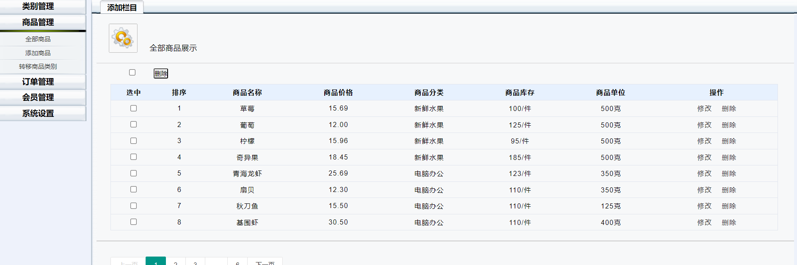

# 商城系统SSM版

## 功能性需求

### **用户端**

- 登陆与注册：允许用户创建新账户或使用现有账户登陆系统。
- 商品列表：展示所有可购买的商品列表，用户可以浏览和搜索商品。
- 商品分类：将商品按照类别进行分组，方便用户快速找到所需商品。
- 商品详情：展示单个商品的详细信息，包括描述、价格、库存等。
- 用户中心：用户可以查看个人信息并进行管理，如修改密码、更新个人资料等。
- 购物车：用户可以将感兴趣的商品加入购物车，并管理购物车中的商品。
- 我的的订单：展示用户的订单列表，包括订单状态、商品详情和订单金额等信息。
- 地址管理：用户可以管理收货地址，包括新增、编辑和删除地址。
- 用户下单：允许用户选择商品、确认订单和选择支付方式进行下单。
- 订单管理：用户可以查看订单状态、订单历史记录，并可以取消订单。

### **管理平台**

- 登陆：管理员登陆系统，获取管理权限。
- 类别管理：管理员可以管理商品的分类，包括新增、编辑和删除分类。
- 商品管理：允许管理员管理所有商品，包括新增、编辑和删除商品信息。
- 订单管理：管理员可以查看和管理所有订单，包括订单状态的更新和取消订单。
- 会员管理：管理员可以管理用户信息，包括查看会员列表、禁止或解禁账户等操作。
- 地址管理：管理员可以查看和管理用户的收货地址，包括新增、编辑和删除地址。
- 系统设置：管理员可以对系统进行基本设置，如网站标题、Logo、联系方式等。
- 权限管理：管理员可以管理其他管理员的权限，确保各级管理员只能访问其权限范围内的功能和数据。

## UI界面

前台页面

后台页面

